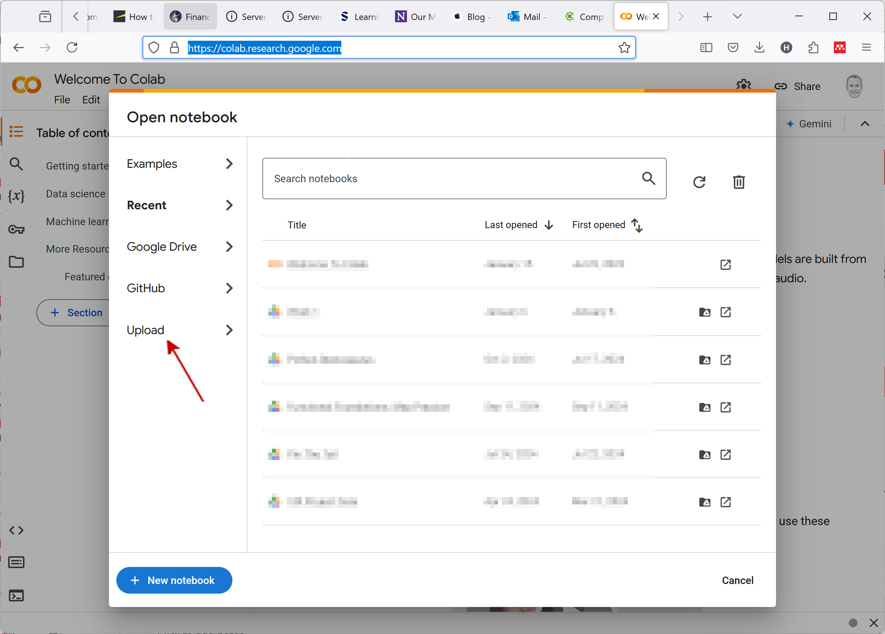
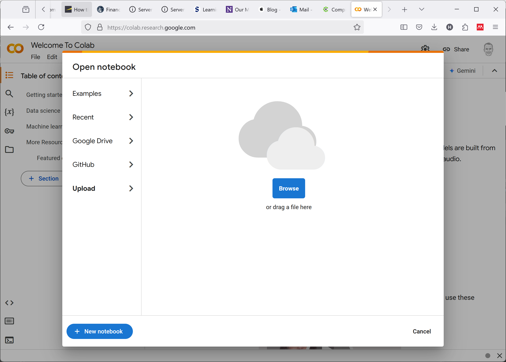
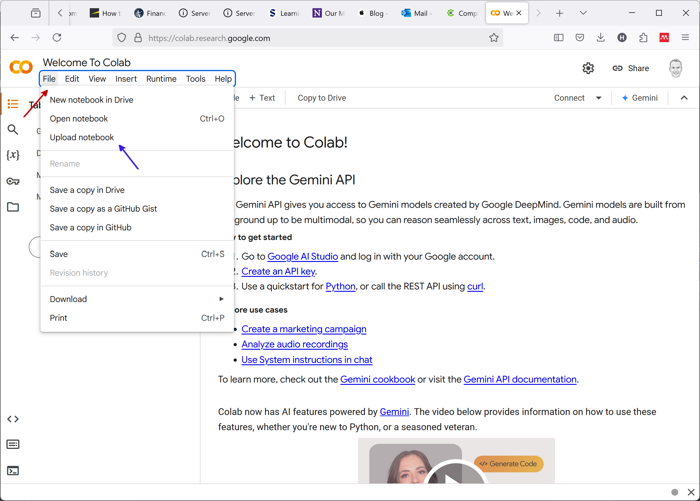
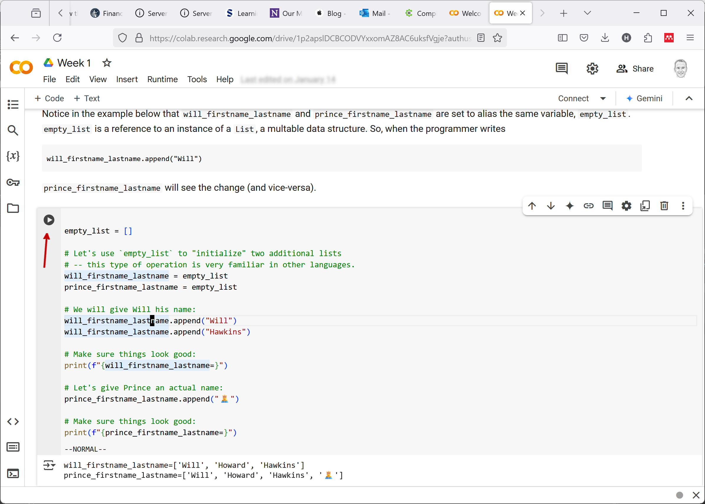
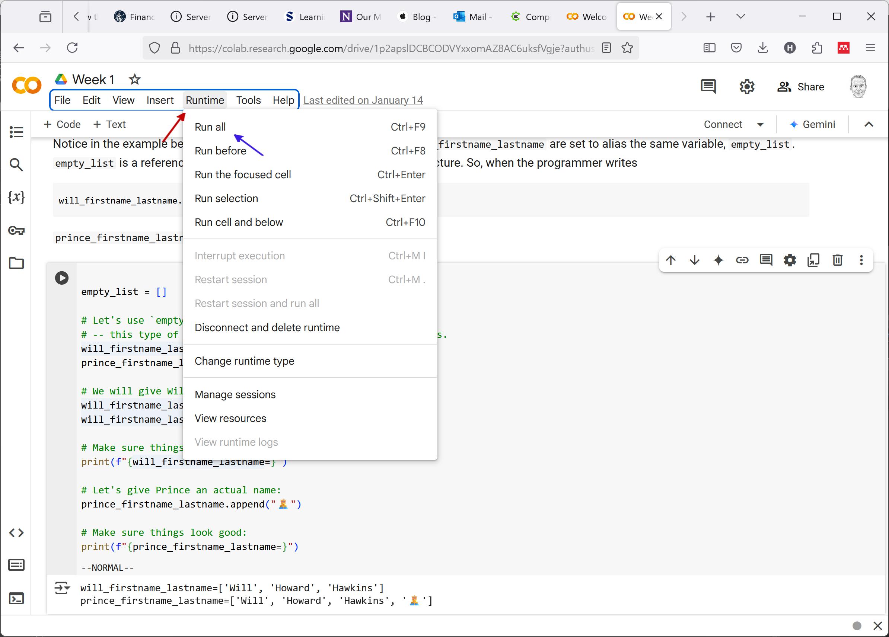

## Using Notebooks

Throughout the semester we are going to use _Notebooks_ in order to share Python code. In particular, we are going to use _Jupyter Notebooks_.[^history]

[^history]: I love the history of modern software. Learning that _Jupyter_ in _Jupyter Notebooks_ comes from a combination of the languages supported in these Notebooks (Julia, Python and R), blew my mind!

A Notebook is simply a way to bundle _text_ with _code_. People have become fascinated by the power of Notebooks, in my opinion, because they give programmers the chance to intersperse a narrative in their code without having to rely on comments. Notebooks give developers the full power of a word processor to write the prose that accompanies their code[^coffeebar] which means they can express themselves more effectively. The proximity of the descriptive text to the code being described makes the writing less cumbersome (e.g., there is no need to write something like, "On line 54 in the second box below.").

[^coffeebar]: When I lived in DC there was a very popular coffee bar called [Politics & Prose](https://politics-prose.com/). I am thinking about starting a place in Cincinnati called Code & Prose. Thoughts?

What's more, Notebooks allow users the chance to "play around" with code from another developer. Because Notebooks make it possible to easily tweak code, Notebooks can give developers "permission" to test their hypothesis about the functionality of code by changing bits and pieces here and there.

Finally, Notebooks have risen in popularity because of their role in supporting Open Science. Reviewers of academic studies have to trust that the authors of a paper had coded their analysis correctly. With Notebooks, study authors can include _all_ the code _and data_ used to generate their conclusions with their paper and the reviewers can verify it. [Pretty](https://www.wsj.com/articles/government-can-do-more-to-support-science-and-innovation-1542758326?mod=e2two) [cool](https://paulromer.net/jupyter-mathematica-and-the-future-of-the-research-paper/).

### A Runtime

At its core, a Notebook is nothing but a specially configured text file that contains formatted prose and Python code. Both the text that the programmer has included in their Notebook _and_ the code sit idle when it is sent between users. In order to make a Notebook come alive, we have to put it somewhere. That somewhere will take text written by the user and render it (display it with formatting) and provide a CPU on which to run the code.

Google has made available a platform named _Colab_ that provides just this type of runtime service for Python notebooks. We will be using Colab in this course.

### A Week 1 Wruntime (sic)

Let's see how we can use Colab to run the Notebook from Week 1. First, simply navigate to [https://colab.research.google.com/](https://colab.research.google.com/). Depending on if/how you are logged in to a Google account, you may immediately see a prompt asking you which Notebook you would like to run.

Click on _Upload_ (as indicated by the red arrow). You will see a window that looks like

Simply drag/drop the Notebook file onto the window.

If you do _not_ have that dialog box when you first access Colab, you can upload a Notebook by going to the _File_ menu (indicated by the red arrow in the image below) and clicking _Upload Notebook_ (indicated by the blue arrow in the image below). 

That will bring up a dialog box where you can upload your Notebook.

### ~~C~~ Python Spot Run

Now you should be in a position where you can see the developer's written prose rendered on the screen and their code displayed inline. Every _cell_ can be run independently of others. 

Be warned that some developers will build dependencies between the cells. Variables from one cell can reference variables in another. So, if you run a cell that has dependencies on variables in a cell earlier in the Notebook and you have not run that cell (or, worse, you ran the earlier cell but subsequently changed the code and did not rerun it), you are in for some odd errors.

If you would prefer, you can always click on _Runtime_, _Run all_ (indicated by the red and blue arrows, below, respectively) to run all the cells at the same time.

